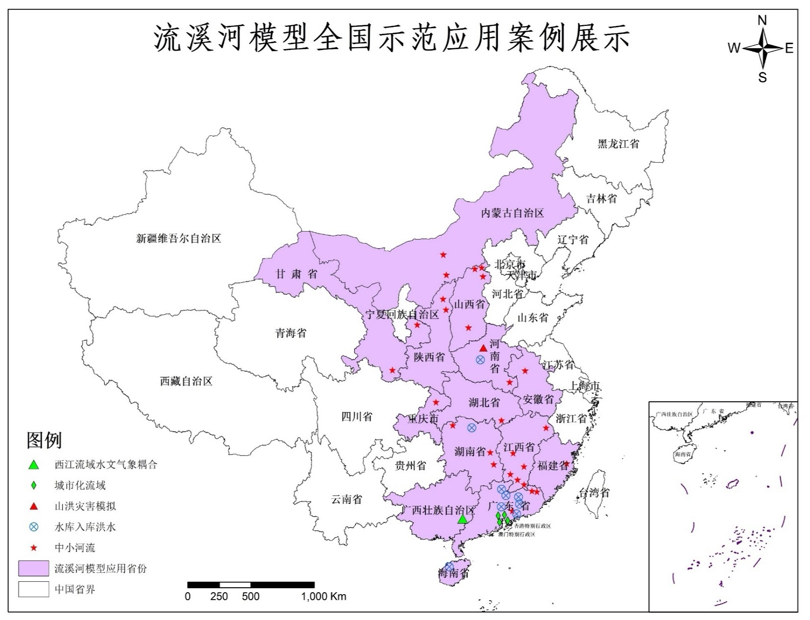

# 浅谈概念水文模型中的参数优化

从早期的新安江模型，到后来的 SWAT 模型，再到如今备受瞩目的可微分水文模型，如何在物理机制的严谨性、科学性与模型整体的实用性之间取得平衡，一直是水文模型构建中需要深思的核心问题。  
过度追求模型物理计算过程的精细化（例如对蒸散发、下渗以及产流的空间异质性进行过度复杂的建模，或是对汇流过程引入复杂的水动力学计算），往往会导致输入数据极难收集，且模型计算耗时急剧上升。这不仅降低了模型的易用性，也阻碍了其在实际工程中的推广应用。  

以可微分水文模型（如 $\delta$-HBV）为代表的方法则走向了另一个极端：通过对物理机制进行进一步的简化与概化，换取更强的可并行性与空间迁移能力。例如，在 $\delta$-HBV 中，为了让整个模拟流程能无缝运行在 PyTorch 框架上以实现可微分计算，汇流部分仅采用了隐式单位线或马斯金根-康吉（Muskingum-Cunge）汇流方法，而产流部分则直接套用了集总式的 HBV 模型。这使得整个模型完全可以通过 PyTorch 的张量计算在 GPU 上进行梯度下降优化，从而实现大范围、乃至无资料地区（PUB）的高精度径流模拟。

然而，这种设计的缺点也十分明显：洪水演进本质上是一个强串行的物理过程，短期降雨的时空分布差异会对最终的洪峰形态产生决定性影响。而 PyTorch 和 CUDA 提供的算子天然是为大规模数据并行设计的，极难在保证计算效率的前提下，将更复杂、更贴合实际物理机制的串行洪水演进模型转化为可微分形式。因此，受限于数据获取与计算效率的双重制约，水文建模领域并不像 AI 大模型领域那样有绝对统一的 Benchmark 性能测评，各种模型在不同的应用场景下各有优劣。

在此，我们简要介绍一下**流溪河模型**的设计原理及参数优化在其中的关键作用。流溪河模型采用等大小的网格（通常为 90m）对流域空间进行划分，并采用圣维南方程组（运动波简化形式）对坡面及河道汇流过程进行求解。其整个下垫面参数被简化为 14 个，理论上均可通过遥感和开源数据集获取。然而，由于开源数据本身存在不确定性与误差，在具体流域建模时，必须引入粒子群优化算法（PSO）对这 14 个参数进行参数优选。

在单线程环境下，流溪河模型模拟一次流域过程大约耗时 2~5 秒。若直接对这 14 个参数进行网格化寻优，理论上的搜索空间将非常庞大。在实践中，我们通常采用全局超参数优化方案，即让全流域所有网格的参数乘以相同的比例系数。即便如此，由于 PSO 算法的迭代机制，搜索一轮（单次迭代）大约耗时 4~8 分钟，完成 100 轮迭代则需要 6~12 小时（并且在搜索后期，单轮耗时会显著增加，这可能与 JVM 的垃圾回收（GC）机制导致的停顿有关）。

更具挑战性的是，根据流溪河模型的最初设计，参数优化应当针对每种独特的“土壤-土地利用”组合单元分别配置一套参数。若按 6 种土壤类型和 6 种土地利用类型计算，待优化的参数总量将达到 $6 \times 6 \times 14 = 504$ 个。此时的参数搜索空间将达到惊人的 $2^{504}$，以现有的计算效率显然是无法实现的。

因此，引入**多线程及分布式并行计算**对流溪河模型的参数优选引擎进行重构，显得尤为重要。计算效率的提升能让我们在相同的时间内探索更广阔的参数空间，从而显著提高模型的率定精度与预测可靠性。

## 关于流溪河模型

流溪河模型是由中山大学陈洋波教授研发的分布式物理水文模型，在 20 多年间不断改进发展，在全国范围内广泛应用，在大中小流域径流预报、水库入洪预报、山洪预报取得了大量实践成果。

[学术报告 | Water：流溪河模型与流域暴雨洪水过程模拟及预报 — 中山大学陈洋波教授](https://www.bilibili.com/video/BV1CF411W7K3/?share_source=copy_web&vd_source=8ff0eaeb4ef050b21444340c4354528e)
